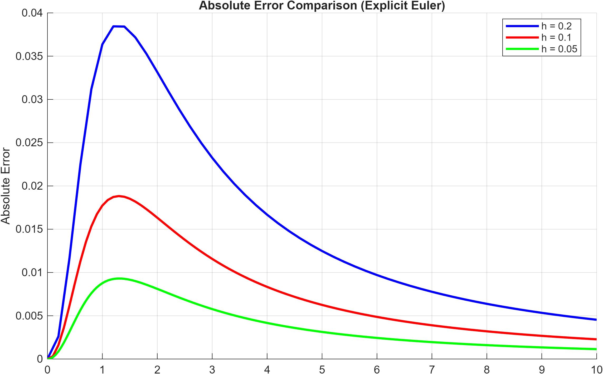
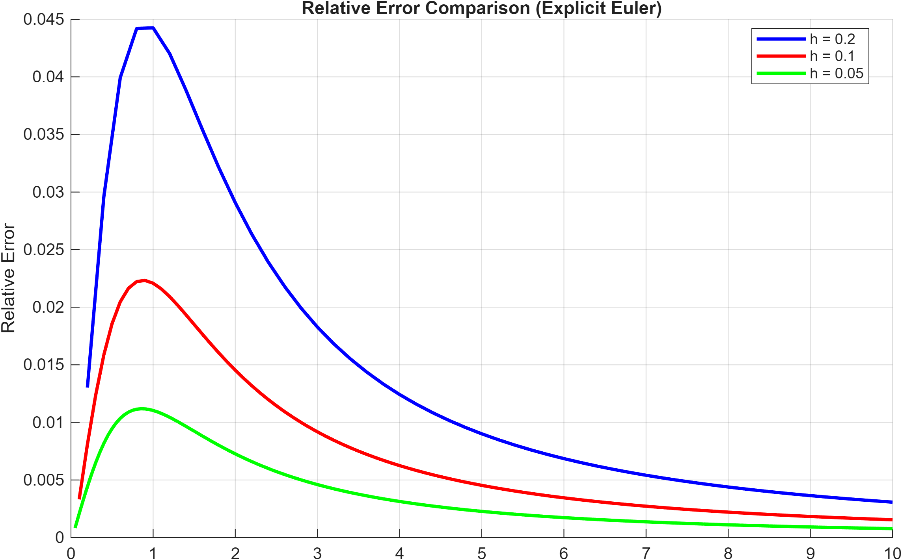
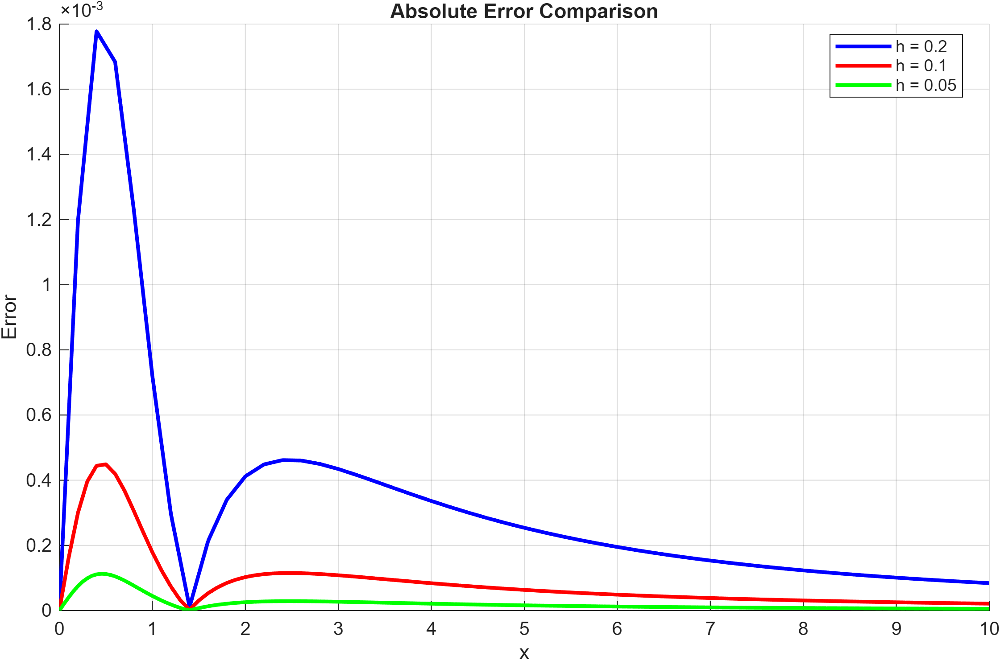
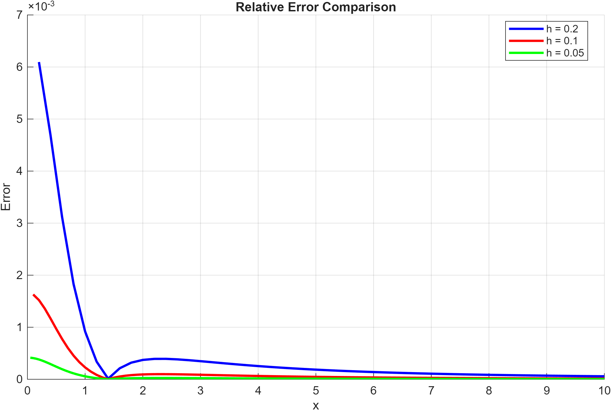
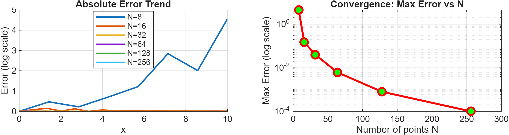

# Numerical Methods for Nonlinear ODEs – Error and Convergence Analysis
## Overview
This project implements and compares different numerical methods for solving an initial value problem for a nonlinear ordinary differential equation. The goal is to analyze numerical accuracy, stability, and convergence behavior under step-size refinement.
## Problem Statement
We consider the nonlinear initial value problem:

 $$ y'(x) = \cos^2(y(x)),  \quad  x \in [0,10], \quad  y(0) = 0 $$

The exact solution is:

$$y(x) = arctan(x)$$

This allows direct computation of numerical errors.
## Numerical Methods
### 1. Explicit Euler Method
- First-order explicit scheme
- Step sizes: h = 0.2, 0.1, 0.05
Error analysis:
- Absolute error $|u(x) - y(x)|$
- Relative error  $|u(x) - y(x)| / |u(x)|$
- Terminal error evaluated at $x = 10$
- Error ratios for step-size refinement
### 2. Crank–Nicolson Method
- Second-order implicit scheme
- Nonlinear solver with tolerance $10^{-6}$
- Step sizes: h = 0.2, 0.1, 0.05

Error analysis:
- Absolute and relative error over the full interval
- Terminal error at x = 10
- Convergence validated by error ratios
### 3. Adams–Bashforth 3-Step Method
- Explicit multi-step method 
- Grid sizes: N = 8, 16, 32, 64, 128, 256
Error metric:
- Infinity norm:
  $\|e\|_{\infty} = max |u(x) - y(x)|$

Convergence analysis:
- Maximum error vs number of grid points N
## Numerical Results
### Explicit Euler
Error ratios at $x = 10$:
- $h = 0.2 \to 0.1:  \quad  1.9933 \approx 2$  
- $h = 0.1 \to 0.05:  \quad 1.9964 \approx 2$ 

These confirm first-order convergence.

Absolute error:
 
Relative error:
 
### Crank–Nicolson
Error ratios at $x = 10$:
- $h = 0.2 \to 0.1: \quad   3.9867  \approx 4.0 $ 
- $h = 0.1 \to 0.05:  \quad  3.9854 \approx 4.0 $ 

These confirm second-order convergence.

Absolute error:
 
Relative error:
 
### Adams–Bashforth (3-step)
The maximum error decreases as the number of grid points increases, confirming convergence of the method.

 

## Key Takeaways
- Euler method shows first-order convergence
- Crank–Nicolson achieves second-order accuracy
- Adams–Bashforth 3-step method shows higher-order convergence behavior
- Step-size refinement significantly improves accuracy for all methods
